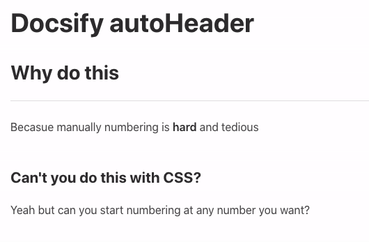
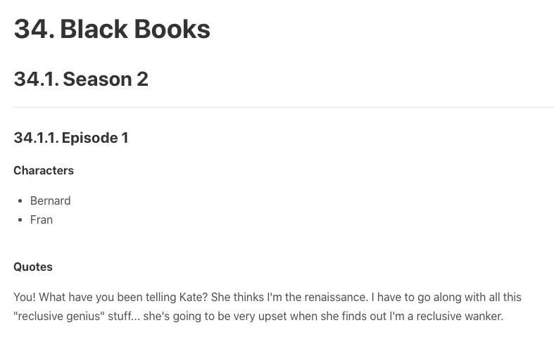

---

# Getting started


## Installation
1. Configure the `docsify-autoHeaders`:
```js
<script>
window.$docsify = {
    autoHeading: {
        separator: '',
        levels:    '',
        scope:     ''
    },
};
</script>
```

2. Insert script into docsify document:
```js
<script src="docsify-autoHeaders.js"></script>
```

## Configuration
There are some options available for the `docsify-autoHeaders`:

| setting   | options |
| :-------- | :------ |
| separator | how you'd like the numbers to be separated. `decimal`, `dash`, or `bracket`
| levels    | heading levels to target `1-6`
| scope     | the `ID` of the holding element. for Docsify this is normally `#main` but I guess if you have `html` inside the `.md` then you can tie it to that instead

## Usage
At the top of your `md` files add the following snippet:

```md
@autoHeader:
```

At the end of the identifier, add the section starting number. If you don't have that it won't auto number (good for pages not needing numbering).

You can :heart: have a starting header at `0` using:

```md
@autoHeader:0
```

## Example
```md
@autoHeader:34

# Black Books

## Season 2

### Episode 1

#### Characters
- Bernard
- Fran

#### Quotes
You! What have you been telling Kate? She thinks I'm
the renaissance. I have to go along with all this
"reclusive genius" stuff... she's going to be very
upset when she finds out I'm a reclusive wanker.
```

### Example output


# Contributing
1. Clone the repo:
```
git clone https://github.com/markbattistella/docsify-autoHeadings.git
```

2. Create your feature branch: git checkout -b my-feature

3. Commit your changes: git commit -am 'Add some feature'

4. `Push` to the branch:
```
git push origin my-new-feature
```

5. Submit a `pull` request


# Roadmap
- [ ] Allow custom separators
- [ ] Allow the scope to be either a `class` or `ID`
- [ ] Convert it to usable outside Docsify

---

# Author: [@me](https://github.com/markbattistella)

- 🔭 I’m currently working on some secret projects
- 🌱 I’m learning
- 📫 Reach me: [Twitter 🐦](https://twitter.com/markbattistella)

---
